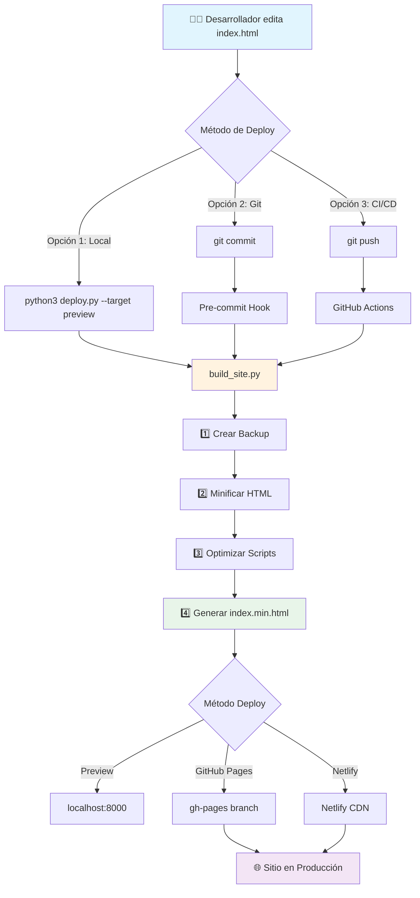
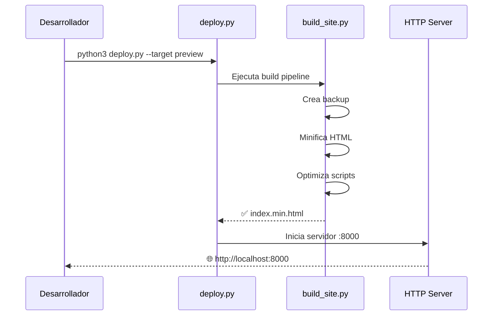
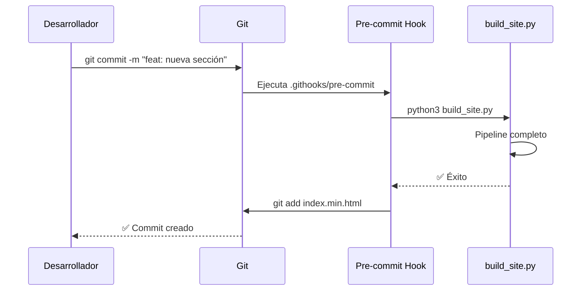
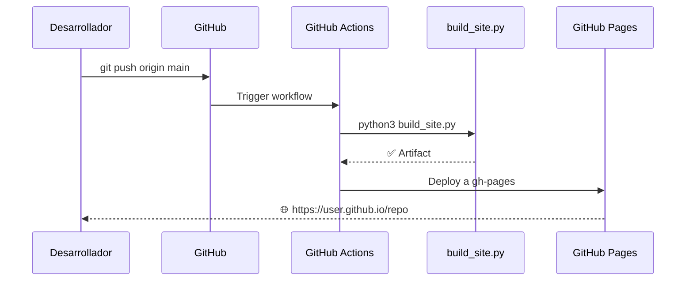

# 🚀 Sistema de Automatización Completo

## 📊 Arquitectura del Pipeline



## 🎯 Flujos de Trabajo

### Flujo 1: Desarrollo Local


### Flujo 2: Deploy con Git Hook


### Flujo 3: CI/CD Automático


## 📁 Estructura del Proyecto

```
ancla/
├── 🛠️ SCRIPTS DE AUTOMATIZACIÓN
│   ├── build_site.py          # Pipeline de construcción
│   ├── deploy.py              # Gestor de despliegue
│   └── DEPLOYMENT.md          # Documentación completa
│
├── ⚙️ CONFIGURACIÓN GIT
│   ├── .githooks/
│   │   └── pre-commit         # Hook automático
│   ├── .github/
│   │   └── workflows/
│   │       └── deploy.yml     # CI/CD Pipeline
│   └── .gitignore             # Archivos ignorados
│
├── 📄 ARCHIVOS DEL SITIO
│   ├── index.html             # Fuente original
│   ├── index.min.html         # Versión optimizada (generada)
│   ├── *.png                  # Assets
│   └── README.md
│
└── 📦 BACKUPS
    └── backups/
        └── index_YYYYMMDD_HHMMSS.html
```

## 🎮 Comandos Rápidos

| Acción | Comando | Descripción |
|--------|---------|-------------|
| **Build** | `python3 build_site.py` | Solo construir (sin deploy) |
| **Preview** | `python3 deploy.py --target preview` | Build + servidor local |
| **GitHub Pages** | `python3 deploy.py --target github-pages` | Build + deploy a GH Pages |
| **Netlify** | `python3 deploy.py --target netlify` | Build + deploy a Netlify |
| **Activar Hook** | `git config core.hooksPath .githooks` | Auto-build en cada commit |

## 🔧 Próximos Pasos

### Paso 1: Configurar Git Hook (Opcional)
```bash
git config core.hooksPath .githooks
```
✅ Ahora cada commit ejecutará automáticamente el build.

### Paso 2: Probar Preview Local
```bash
python3 deploy.py --target preview
# Navega a: http://localhost:8000
```

### Paso 3: Configurar GitHub Pages
```bash
# Push de los archivos de configuración
git add .github/ .githooks/ build_site.py deploy.py .gitignore DEPLOYMENT.md
git commit -m "feat: add deployment automation"
git push

# Luego en GitHub:
# Settings > Pages > Source: gh-pages branch
```

### Paso 4: (Opcional) Netlify
```bash
# Instalar CLI
npm install -g netlify-cli

# Login
netlify login

# Deploy
python3 deploy.py --target netlify
```

---

**¡Tu sistema de automatización está completamente configurado!** 🎉
