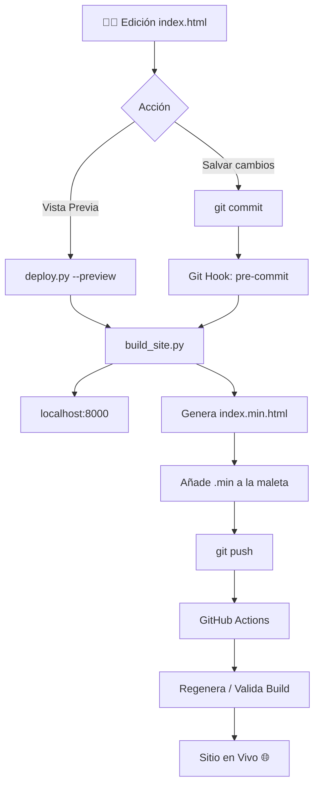

# 🏗️ Arquitectura de Automatización CI/CD - Ancla

Este documento detalla el sistema de engranajes técnicos que hemos construido. El objetivo es que tú solo escribas código simple y legible en `index.html`, y el sistema se encargue de la seguridad, la velocidad y la publicación.

---

## 🗺️ Mapa del Sistema (Workflow)

---

## 🔧 Los 4 Componentes Clave

### 1. El Motor: `build_site.py` (Python)
Es el cerebro de la operación. Realiza tres tareas fundamentales:
*   **Seguridad (Backup):** Antes de mover una coma, crea una foto de tu archivo en `/backups`.
*   **Velocidad (Minificación):** Comprime el código eliminando espacios muertos y comentarios, pero es lo suficientemente inteligente para saltarse tus anclajes `<!-- CONTENT -->`.
*   **Optimización (Defer):** Modifica las etiquetas de script para que la web no se bloquee mientras carga.

### 2. El Vigilante: `.githooks/pre-commit` (Bash)
Este es un "script de seguridad" integrado en Git.
*   **Qué hace:** Se activa automáticamente en el milisegundo que escribes `git commit`. 
*   **Por qué importa:** Te garantiza que **nunca** subirás código sin optimizar por accidente. Si el build fallara (por un error de sintaxis), el Vigilante detiene el commit y no te deja subir nada roto.

### 3. El Controlador: `deploy.py` (Python)
Es tu centro de mando. En lugar de recordar comandos complejos de servidor o de subir archivos por FTP, usas este script con "targets":
*   `--target preview`: Levanta un servidor inteligente que busca puertos libres (8000, 8001...) para que visualices tu trabajo.
*   `--target github-pages`: Automatiza el envío a la rama de publicación de GitHub.

### 4. El Capitán en la Nube: `.github/workflows/deploy.yml` (YAML)
Es el robot que vive en los servidores de GitHub (GitHub Actions).
*   **Su misión:** Recibir tu `push`, levantar un servidor virtual, ejecutar tus scripts de Python nuevamente para verificar que todo está bien y luego poner el sitio en línea.
*   **Beneficio:** Si tu PC se rompe, el proceso de publicación sigue siendo el mismo desde cualquier lugar del mundo.

---

## 🧼 El Filtro: `.gitignore`
Este archivo es silencioso pero vital. 
*   **Función:** Le dice a Git: *"No guardes las copias minificadas o basura temporal en el historial"*. 
*   **Resultado:** Tu repositorio de código se mantiene limpio, solo con los archivos originales en los que tú trabajas, evitando que el historial se ensucie con miles de versiones comprimidas ilegibles.

---

## 💡 Filosofía del Diseño

He diseñado esto bajo el principio de **"Cero Fricción"**:
1.  **Editas** lo que es legible.
2.  **El sistema** genera lo que es eficiente.
3.  **La automatización** asegura que el proceso sea idéntico en tu PC y en la nube.

Este nivel de automatización es el que usan equipos de ingeniería en empresas como Google o Airbnb para manejar despliegues rápidos y seguros. ⚓🚀
